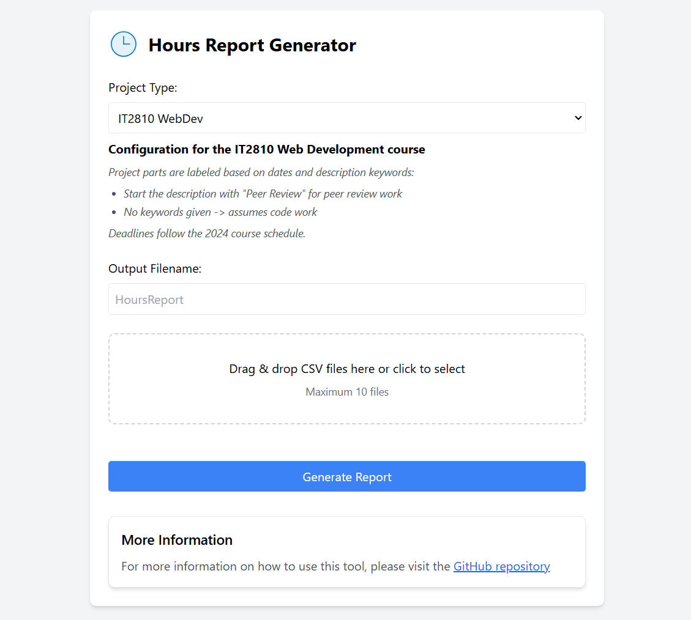
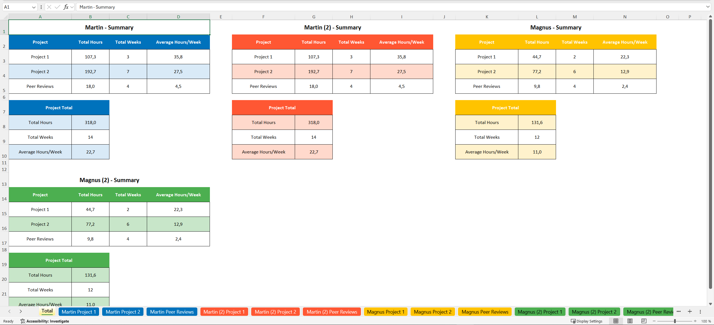
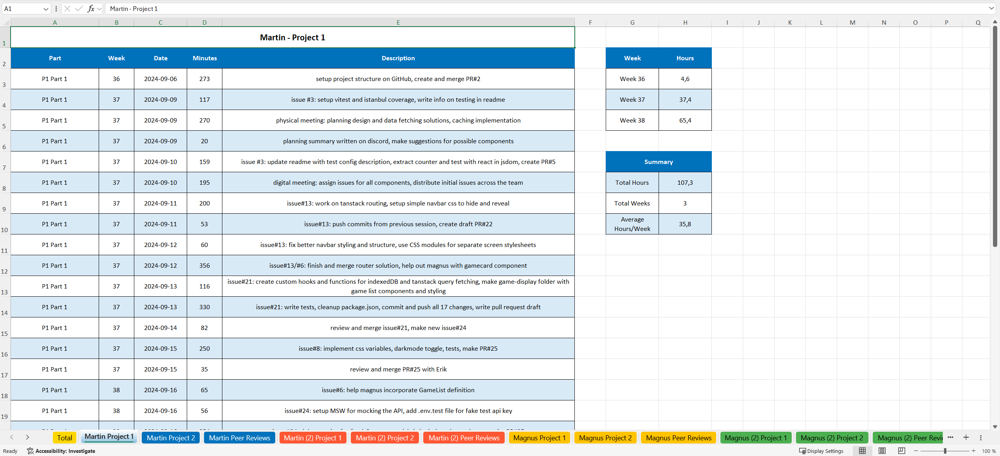

# HoursReportGenerator

Tool for generating formatted Excel reports from time tracking CSV files.

Note that this tool was initially designed for specific project structures at NTNU, currently supporting:
- IT2810 Web Development course (2024)
- IT2901 Informatics Project II course (2025)

To support other project structures, custom project configurations can be created (see the [Local Development Guide](docs/local-development.md)). Future updates may include a more user-friendly way to create and manage custom project configurations in the web interface.

## Web Application

The current version of the tool is available online at: [hoursreportgenerator.onrender.com](https://hoursreportgenerator.onrender.com/)



### How to Use

1. Select your project type from the dropdown
2. Read about the keywords expected in the CSV files
3. Enter an optional custom filename for the report
4. Drag and drop your CSV files or click to select them
5. Click "Generate Report" to create and download your Excel report

### Example Output

The generated Excel report contains both individual sheets for each dataset and a comprehensive summary sheet.

**Summary Sheet**
Shows total hours, weeks, and averages across all datasets:


**Individual Dataset Sheets**
Detailed breakdown of time entries and weekly statistics for each dataset:


Each dataset gets its own color scheme for easy visual distinction, and the sheets are organized with:
- Chronological list of all time entries with dates and descriptions
- Weekly hour totals
- Summary statistics including total hours and weekly averages

## CSV Format Requirements

The application expects CSV files with the following format:

### Required Columns
- `startTime`: ISO 8601 datetime string (e.g. "2024-09-05T09:58:00.000000000Z")
- `duration`: Integer number of minutes (can be wrapped in quotes, e.g. "75")
- `description`: String description of the session wrapped in triple quotes 

### Example Row
```csv
"2024-09-05T09:58:00.000000000Z",75,"""working on issue#45: added 'quote' thing"""
```

### Notes
- The description field can contain single quotes but not double quotes
- Depending on the project configuration, the description may be used to label time entries

## Local Development

For detailed instructions on setting up and running the application locally, including:
- Environment setup
- Running the Flask server
- Creating custom project configurations
- Command line usage
- Report generator options

See the [Local Development Guide](docs/local-development.md).

## Future Plans
- Store and manage project configurations in a database
- Make an interactive UI for creating and editing project configurations